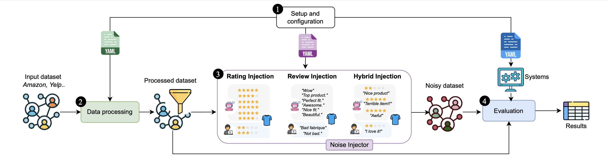

# RecProbe: Stress-Testing Recommender Systems via Systematic Noise Injection 
RecProbe is currently under review as a resource paper at SIGIR 2026.


**RecProbe**, is a resource designed to evaluate robustness by generating controlled perturbations of ratings, reviews, and their combinations. RecProbe features a flexible perturbation module along with a comprehensive evaluation pipeline that compares baseline models on both clean and perturbed datasets, allowing for systematic analysis of noise effects. 

# :bookmark: Outline
1. [Before starting](#before-starting)
4. [Configuration](#recprobe-configuration)
5. [Installation and Usage](#installation-and-usage)
   


# :airplane: Before starting 
## What is RecProbe?
RecProbe is a framework designed to systematically perturb user–item interaction datasets and evaluate how recommender systems behave under realistic noise conditions.
RecProbe provides three level of noise injections, all configurable with dedicated YAML files.
- :star: **rating level**: the noise applies to rating values
  - *Random inconsistencies*: simulates the behavior of a real user, introducing occasional misreported ratings.
  - *Rating bursts*: simulates abnormal activity where a user or an item receives many ratings in a short time, mimicking bots or coordinated behaviors.
  - *Timestamp corruption*: introduces missing, incorrect, or inconsistent timestamps to test models relying on temporal patterns.
- :abcd: **review level**: the noise applies to the textual review
  - *Random inconsistencies*: missing or incomplete reviews to mimic users who rate without providing text.
  - *Semantic noise*: introduces off-topic, irrelevant, or incoherent content, including potential AI/bot-generated text.
  - *Review bursts*: injects large volumes of reviews from a few users or targeting specific items in a short period, simulating spam or fraudulent activity.
- :heavy_plus_sign: **hybrid level**: the noise applies to the combination of textual review and rating.
  - *Random inconsistencies*: creates contradictions between ratings and review sentiment (e.g., a low rating with a highly positive review).
  - *Semantic drift*: introduces divergence between review content and item context (e.g., a review for hiking boots describing them as “perfect for the beach”).
  - *Hybrid bursts*: systematically pairs positive ratings with negative reviews and vice versa, stressing models that rely on both ratings and text.


## Pipeline


**Setup and configuration.** In this phase, the user supplies a configuration for each stage of the pipeline. The first step involves compiling three YAML files, which are used to perturb the original dataset and calculate baseline results.

**Data processing.** The initial dataset is preprocessed for the subsequent phases of the pipeline: in this phase the user can (optionally) extract the k-core, filter by rating o review length.

**Noise injection.** The perturbation is applied, according to the configuration provided by the user. The injection generates a new noisy dataset. 

**Evaluation.** The user defines a set of baselines that enable comparison between the original (unperturbed) dataset and the perturbed version. RecProbe then generates a single comparison table summarizing the results.

# :screwdriver: RecProbe Configuration
### Input and Output
RecProbe requires in input one file in JSONL, JSON or CSV containing the following fields:
- user_id: the id of the user rating the item
- item_id: the id of the rated item
- rating: the rating given by a user to an item -- it is usually a numerical value
- review_text: the textual review
- title: title of the review (optional)

If the dataset is yelp or a subset of amazon reviews 23, RecProble already provides support for them, just add "amazon" in the name of the dataset, for example: *amazon_All_Beauty*.
If the custom dataset contains these fields but with a different name, provide a mapping in the file ```src/data_model/reviewModel.py```.


The original dataset must be place inside the folder ```src/data/input/<name_of_the_dataset>/```; the generated perturbed dataset (in JSONL, JSON or CSV) will be placed inside ```src/data/output/<name_of_the_dataset>/```. 

### YAML Configuration

:warning: *Read this section to configure YAML manually. If you plan to use the user inteface, jump to [Installation and Usage](#installation-and-usage)* :warning:
YAML configuration is recommended to have full control of the pipeline.

RecProbe requires at least two YAML configuration files: a base configuration file and a noise injection configuration file. 

The base file, located at `src/config/files/config_base.yaml`, defines the general pipeline setup, including data processing options as well as input and output formats. In this file, the dataset name must be the same as the one of the ```src/data/output/<name_of_the_dataset>/```.

In addition, users must configure one of the noise injection YAML files located in `src/config/files/<injection_level>`, depending on the desired injection level (rating, review, or hybrid). Each folder contains one YAML file for each injection strategy; the user has to select the YAML file corresponding to the injection strategy they wnat to apply and configure the parameters for the corresponding injection strategy. 

For example, to apply the *rating burst* strategy, the user should first configure `config_base.yaml`, and then edit `rating/rating_burst.yaml` by specifying the injection budget and the parameters under the `rating_burst` section. 

For the users not familiar with YAML files, they cane rely on the related streamlit interface which ease the process of configuration. See [Streamlit user interface](###streamlit-user-interface).

### Evaluation
The evaluation module enables users to compare the performance of a set of baseline models (selected by the user) on the dataset before and after the perturbation.
- **Custom evaluation**. Users can assess the perturbed and original datasets using custom baseline models and evaluation metrics (see Section [Customization](#customization)).

- **Cornac evaluation**. Users can evaluate baseline models implemented in Cornac by specifying the desired methods and evaluation metrics directly in the corresponding YAML configuration file. Each baseline can be configured by setting its parameters and selecting the metrics to compute.

- **RecBole evaluation**. Users can evaluate models supported by RecBole by defining the methods, hyperparameters, and evaluation metrics within the dedicated YAML configuration files. The framework automatically loads the specified configurations and performs the evaluation accordingly.


# Installation and usage
Once configured the YAML files and added the datasets in the data folder, follow these steps to install and use RecProbe.
## Install from Docker
RecProbe is distributed as a docker image in order to provide easy deployment independently of the host operative system and infrastructure. 

First, it is required to build the docker image:
```
docker build -t recprobe .
```

### Run streamlit user interface 
If you want to use the user inteface to configure RecProbe and inject noise:
```
docker run --rm  -ti --gpus '"device=1"' --name recprobe-container -v /src/data/:/code/src/ recprobe:latest python3 streamlit/str.py 
```

### Run with manual YAML Configuration
If you configured your YAML manually, run the container:
```
docker run --rm  -ti --gpus '"device=1"' --name recprobe-container -v ./src/data/:/code/src/ recprobe:latest python3 main.py --profile=rating --noise_injection=rating_burst --baselines
```

To simply enter the container shell:
```
docker run --rm  -ti --gpus '"device=1"' --name recprobe-container -v ./src/data/:/code/src/ recprobe:latest 
```
If you want to run the container with no gpu, just avoid the ```--gpus``` parameter.


## From source (for development)
If you want to provide custom methods and implementations, it is recommended to have the entire project. 

```
git clone https://github.com/RecSysQuality/RecProbe.git
cd RecProbe
python3.10 -m venv venv
source venv/bin/activate
pip install --upgrade pip
pip install -r requirements.txt
```


